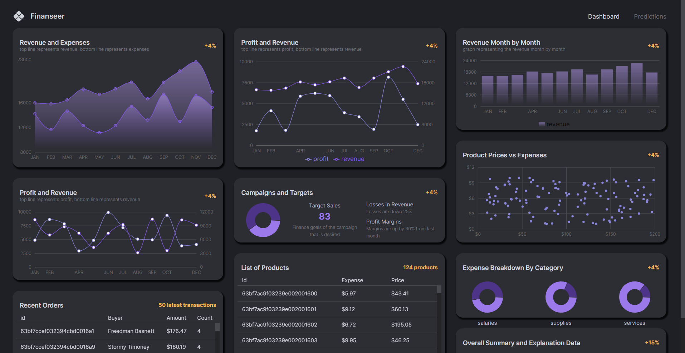

<h1 align="center"> Finanseer </h1>

## 💻 Project
Full Stack Finance Dashboard.

Want to access the live project? [Click here!](https://mern-finance-dashboard.netlify.app/)  
Because of where backend is hosted, it might take a while for it to start, so please be patient!

    

## 🚀 Techs
<h3 style="color: #61dbfb; font-weight: bold ">Front-End</h3>
Vite 
ReactJs 
React Router Dom 
Redux 
TypeScript 
MUI 
Recharts 
Regression  

<h3 style="color: #3c873a; font-weight: bold ">Back-End</h3>
NodeJs 
Express 
nodemon 
Helmet 
Body Parser 
Cors 
dotenv 
MongoDB 
Mongoose 
Morgan 

                                              
